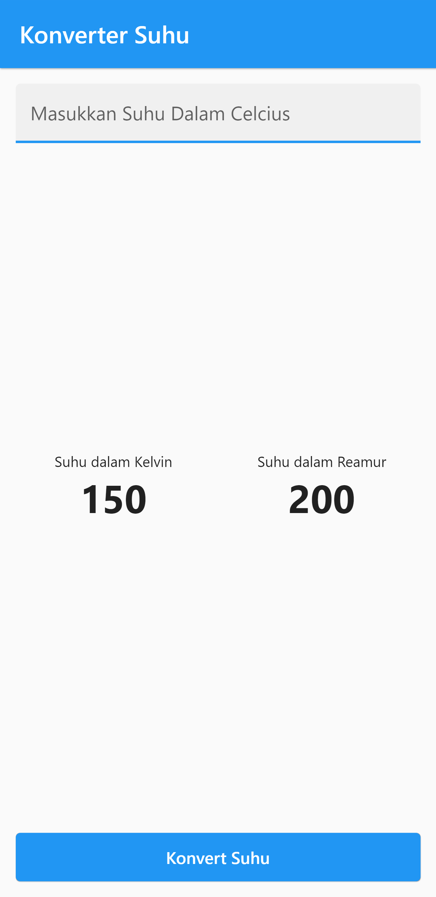
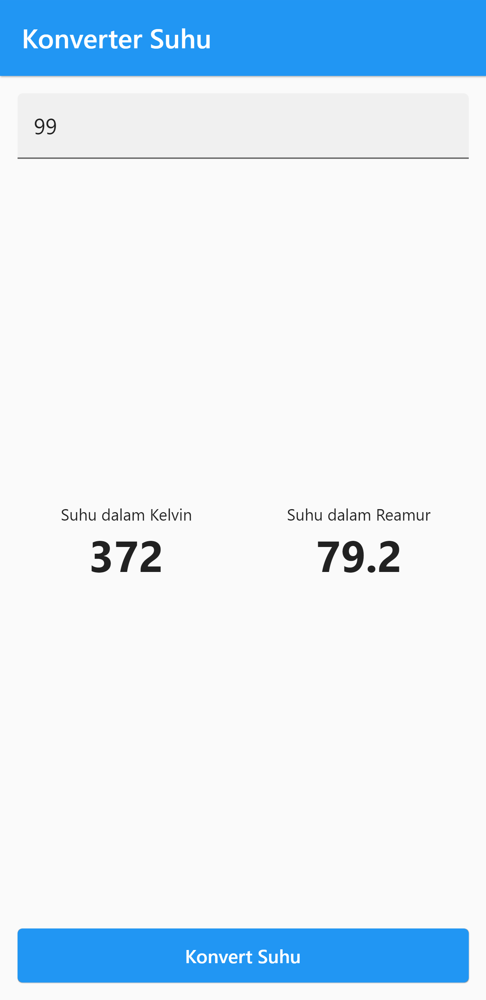
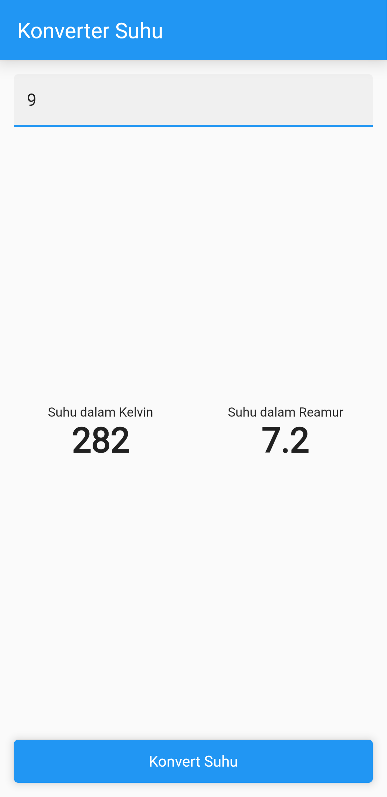

# Konversi Suhu Flutter

        Nama  : Annisa Fitri Yuliandra
        Kelas : TI 3B
        Absen : 09
        NIM   : 2041720123

## Praktikum 3.2 : Layout App
- [Kode Layout App](https://github.com/AnnisaFitry/konversi_suhu_flutter/commit/193c1f14905f99129285e4ddf271a3c84357b5b3)

Hasil : 

## Praktikum 3.3 : Logic App
- [Kode Logic App](https://github.com/AnnisaFitry/konversi_suhu_flutter/commit/b1f3b72df48bb4f4838a1ed6836aa0a9c4d54b47)

Hasil : 

## Praktikum 3.4 : Extract Widget
- [Kode Extract Widget](https://github.com/AnnisaFitry/konversi_suhu_flutter/commit/4dba2cc53c4712832fab16c453b12ed6b4e57065)

Hasil : 

